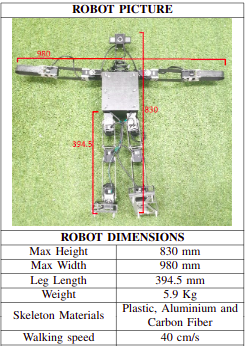

# Projeto Ora Bolas

Projeto semestral da matéria de Física Clássica, ministrada no Centro Universitário FEI. Consiste na leitura de arquivo de posição da bola e a confirmação se ocorre interceptação do robô.


## Funcionalidade

O programa lê o arquivo de trajetória da bola e utilizando atributos do robô small size mostra se é possível o robô interceptar a bola ou não. Para definir se haverá a intercepção leva-se em conta o raio de interceptação do robô, sua velocidade de movimento e a posição inicial sendo definida pelo usuário.

**1 - Small Size** - Caracteristicas do robô utilizado. 



## Execução

Tanto no Windows quanto no Linux a execução é feita a partir da execução da linha a seguir no terminal, ou utilizando uma IDE de sua preferência. 

```bash
python BR_main.py
```

Entretanto, utilizando apenas a linha acima é possivel que o compilador de sua máquina utilize o python em sua versão 2.7. Para resolver isso é mais vantajoso utilizar:

```bash
python3 BR_main.py
```