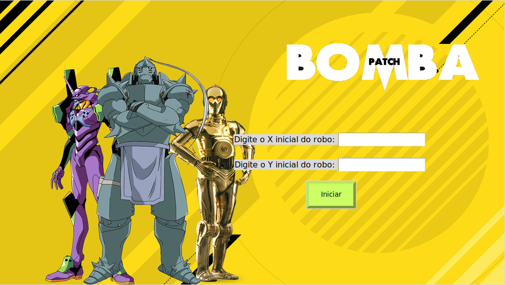
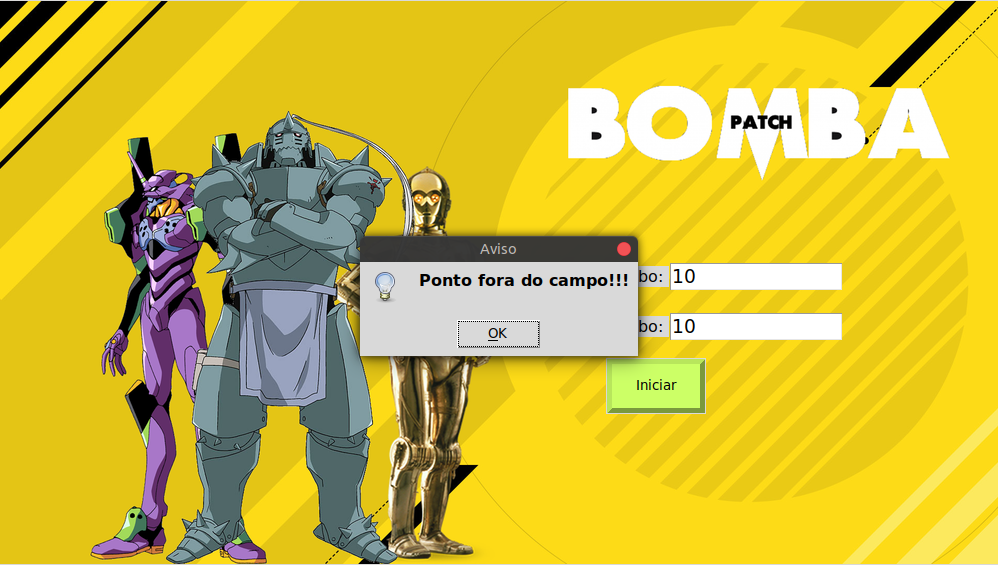
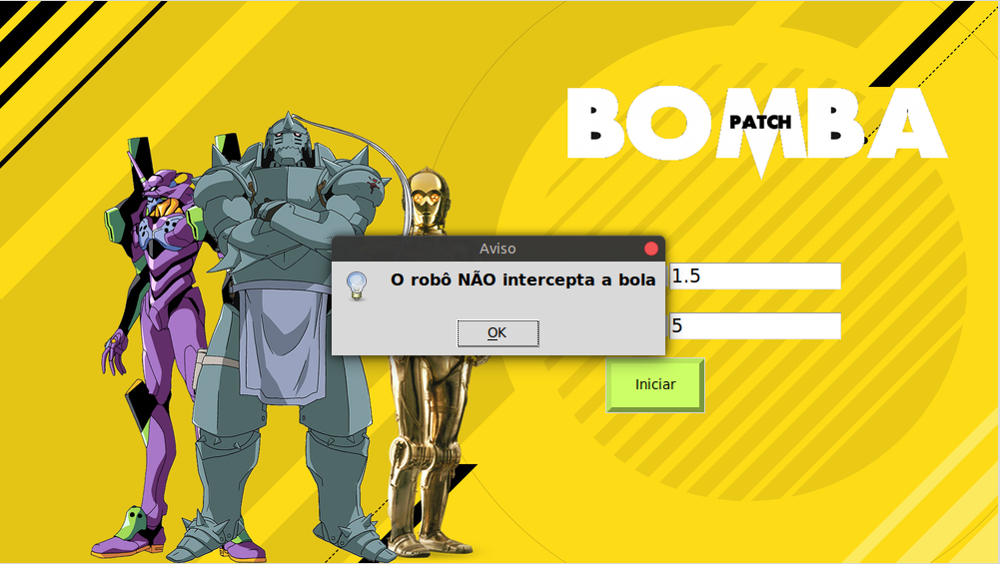

# Projeto Ora Bolas

Projeto semestral da matéria de Física Clássica, ministrada no Centro Universitário FEI. Consiste na leitura de arquivo de posição da bola e a confirmação se ocorre interceptação do robô.


## Funcionalidade

O programa lê o arquivo de trajetória da bola e utilizando atributos do robô small size mostra se é possível o robô interceptar a bola ou não. Para definir se haverá a intercepção leva-se em conta o raio de interceptação do robô, sua velocidade de movimento e a posição inicial sendo definida pelo usuário.

**1 - Small Size** - Caracteristicas do robô utilizado. 


## Execução

Tanto no Windows quanto no Linux a execução é feita a partir da execução da linha a seguir no terminal, ou utilizando uma IDE de sua preferência. 

Inicialmente deve-se instalar as bibliotecas necessárias:

```bash
python -m pip install -U pip
python -m pip install -U matplotlib
```

```bash
python BP_main.py
```

Entretanto, utilizando apenas a linha acima é possivel que o compilador de sua máquina utilize o python em sua versão 2.7. Para resolver isso é mais vantajoso utilizar:

```bash
python3 BP_main.py
```

## Funcionamento

Assim que inicia a aplicação o usuário deve inserir a posição em X e Y do robô, para que o cálculo seja realizado e possibilite a previsão de contato entre o robô e a bola, levando em conta a trajetória da mesma, bem como a velocidade do robô. 
Para isso utilizamos a fórmula de distância entre dois pontos, para calcular todas as possibilidades de tempo a partir da posição inicial do robô e a trajetória da bola (provinda do arquivo txt).



Desse modo há a possibilidade de três casos:

### 1 - Posição fora do campo



### 2 - Robô não consegue alcançar a bola



### 3 - Robô consegue alcançar a bola


Nesse último caso, observa-se na direita todas as possíveis movimentações onde o robô alcançará a bola, bem como o tempo que levará para chegar nessas determinadas posições.

Além disso, na esquerda há um menu contendo todos os possíveis gráficos referentes as interceptações do robô.
